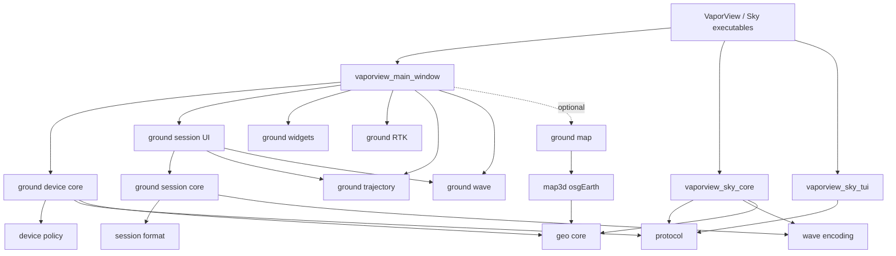
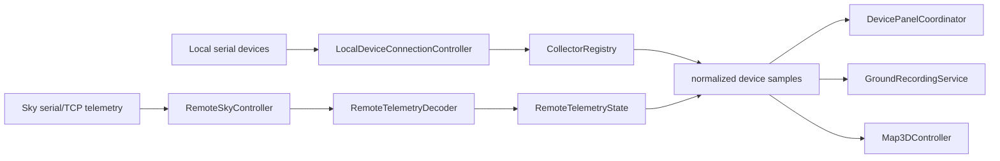
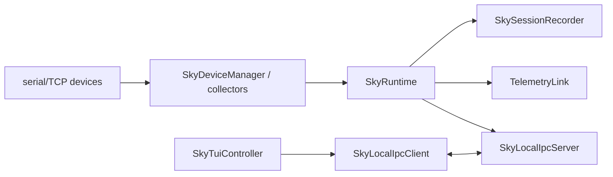

# VaporView Architecture

This document describes the module and build boundaries implemented by the
current source tree. It is a placement guide as well as a description of the
runtime design: new code should follow these dependency directions instead of
growing the application windows again.

## Executables

| Executable | Responsibility |
| --- | --- |
| `VaporView` | Ground desktop application. Creates `MainWindow`, owns the top-level Qt event loop, and exposes ground navigation. |
| `VaporViewSkyCore` | Headless sky process. Owns devices, telemetry transports, session recording, and the local IPC server. |
| `VaporViewSkyTui` | Terminal UI client for the sky core over local IPC. |
| `VaporViewSky` | Compatibility launcher that combines the existing sky startup and TUI behavior. |
| `str2str` | RTKLIB stream utility, built when the bundled RTKLIB sources are available. |
| `vaporview_building_tileset` | Optional osgEarth/GDAL map preparation tool. |

The Sky Core and Sky TUI remain separate processes. Ground refactoring must
not move device ownership or recording into the TUI process, and it must not
change the existing IPC or telemetry protocol.

## Directory layout

```text
cmake/
  Dependencies.cmake       # Qt, threads, RTKLIB, and optional dependency discovery
  CompilerOptions.cmake     # project compiler policy
  PlatformConfig.cmake     # runtime staging and platform behavior
  PythonBindings.cmake     # optional pybind11 target
  InstallRules.cmake       # installation rules
src/
  app/                     # executable entry points and runtime resources
  shared/
    telemetry/             # wire codec, link abstraction, and shared configuration
    config/
    session/               # shared session sensor CSV format
    theme/                 # application theme and reusable popup implementation
    wave/                  # TCP waveform encoding
  ground/
    main/                  # top-level window composition and window-only coordination
    devices/               # local/remote device controllers, policy, decode, and state
    session/               # recording, session core, timeline/playback, and viewer UI
    widgets/               # ground display/input widgets and panel coordinator
    rtk/                   # RTK dialog and stream service
    trajectory/            # trajectory viewer UI
    wave/                  # live wave panel and raw-data viewer
    map/                   # optional ground-side map lifecycle controller
  sky/
    core/                  # sky runtime
    devices/               # collectors, serial/TCP links, and device protocols
    ipc/                   # local Core/TUI IPC
    recording/             # sky session recorder
    tui/                   # TUI model, controller, theme, and startup UI
  geo/                     # coordinate and trajectory logic
  map3d/                   # optional osgEarth rendering implementation
  rtk/                     # RTKLIB adapter target
include/
  ground/                  # stable cross-target ground data contracts
  geo/                     # stable coordinate and trajectory contracts
  map3d/                   # stable optional map/render contracts
  *.h                      # existing stable telemetry, sky, transport, and collector APIs
tests/                     # behavior tests, grouped and labelled by risk/scope
```

Internal UI headers live beside their implementation under `src/`. The flat
headers still present in `include/` are an existing compatibility surface used
by the ground and sky targets; moving them solely to obtain a prettier tree
would create unnecessary API churn. New stable APIs should use a module
subdirectory such as `include/geo`, `include/ground`, or `include/map3d`.

## CMake structure and targets

The top-level `CMakeLists.txt` contains project-wide language settings,
options, dependency/module inclusion, and `add_subdirectory` calls. Source
lists and target-specific dependencies are owned by module CMake files under
`src/`; test targets are owned by `tests/CMakeLists.txt`.

### Shared and platform-neutral logic

| Target | Purpose | Important dependencies |
| --- | --- | --- |
| `vaporview_protocol` | Telemetry codec, link contract, and sky configuration | Qt Core |
| `vaporview_wave_encoding` | TCP waveform byte encoding | Qt Core |
| `vaporview_session_format` | Shared session sensor CSV format | Qt Core |
| `vaporview_geo_core` | Coordinates, track quality, buffers, and replay | Qt Core |
| `vaporview_app_theme` | Shared Qt theme and popup UI | Qt Widgets |

### Sky targets

| Target | Purpose | Important dependencies |
| --- | --- | --- |
| `vaporview_sky_core` | Device collectors, transports, protocol execution, recording, and IPC server | protocol, wave encoding, geo, Qt Core/Network/SerialPort |
| `vaporview_sky_tui` | Sky TUI and IPC client | protocol, app theme, Qt Core/Network/Widgets |

### Ground targets

| Target | Purpose | Important dependencies |
| --- | --- | --- |
| `vaporview_ground_device_policy` | Pure sample-rate parsing/clamping and EPSILON packet-rate policy | Qt Core |
| `vaporview_ground_temperature_command_state` | Confirmed RD105 state mapping and serial-setting persistence | Qt Core |
| `vaporview_ground_device_core` | Collector registry, local connection lifecycle, serial detection, EPSILON/IMU configuration, remote link/state/decode | device policy, protocol, geo; sky core is private implementation |
| `vaporview_ground_session_core` | Recording service/layout, CSV load/export, indexing, playback, timeline, and waveform repository | session format, wave encoding, Qt Core |
| `vaporview_ground_session_ui` | Session viewer composition and plot/table widgets | session core plus ground view targets, Qt Widgets |
| `vaporview_ground_widgets` | Telemetry panels, temperature UI, EPSILON view, and `DevicePanelCoordinator` | app theme, Qt Widgets/Svg |
| `vaporview_ground_ui_support` | Shared title bar, device dialog, and window sizing | Qt Widgets; theme/device dependencies are private |
| `vaporview_ground_main_support` | Internal drawing, icon, style, and window-chrome helpers | Qt Widgets/Svg |
| `vaporview_ground_rtk` | RTK configuration dialog and RTK stream lifecycle | RTKLIB, Qt Network/SerialPort/Widgets |
| `vaporview_ground_trajectory` | Trajectory viewer | geo, Qt Widgets |
| `vaporview_ground_wave` | TCP waveform and raw-data windows | protocol, wave encoding, Qt Network/Widgets |
| `vaporview_main_window` | Top-level ground window composition | ground modules above; osgEarth path is conditional |

### Optional map targets

| Target | Purpose | Important dependencies |
| --- | --- | --- |
| `vaporview_map3d_osgearth` | Map data, OSG view, terrain, track, and aircraft rendering | geo, app theme, Qt OpenGL/Widgets, osgEarth/OSG |
| `vaporview_ground_map` | Owns and updates the optional map window | map3d, geo, Qt Core/Widgets |

The important dependency direction is summarized below. Arrows mean
"depends on"; implementation-only dependencies are omitted when they do not
change the direction.



Core targets (`device_policy`, `temperature_command_state`, `session_core`,
`session_format`, `protocol`, `wave_encoding`, and `geo_core`) do not link Qt
Widgets. UI targets expose Qt Widgets only where their public types require it;
other dependencies are `PRIVATE`.

## Ground runtime flow

### Local and remote telemetry



`MainWindow` selects local or remote mode and wires top-level signals. It does
not parse telemetry packets, own raw transport loops, fan out every panel field,
or dispatch individual local sample-rate/RD105 collector methods.

`LocalDeviceConnectionController` owns asynchronous local connect/cancel/
disconnect behavior, the collector registry, sample-rate application, and
local RD105 command execution. `ImuConfigurationService` owns the IMU ASCII
profile sequence, direct-port configuration, and restart behavior.
`RemoteSkyController` owns the remote telemetry link and command sequence.
`RemoteTelemetryDecoder` and
`RemoteTelemetryState` turn wire messages into stable ground state.

### Session recording and viewing

```mermaid
flowchart LR
  Samples["device samples and raw frames"] --> GRS["GroundRecordingService"]
  Sky["SkySessionRecorder"] --> Init["SessionPackageInitializer"]
  GRS --> Init
  Init --> Layout["SessionPackageLayout + SessionManifest"]
  Layout --> Files["unified Ground/Sky session package"]
  Files --> Loader["SessionLoader / SessionCsv"]
  Loader --> Index["SessionIndex / SessionWaveformRepository"]
  Index --> Playback["SessionPlaybackController / SessionTimelineModel"]
  Playback --> Controller["SessionTrajectoryController"]
  Controller --> View["SessionViewerWindow + SessionViewerPages"]
  View --> Map["SessionMapCoordinator"]
```



Session file parsing and export, indexing, waveform lookup, time formatting,
playback state, and timeline bounds are independent of QWidget. The viewer
owns layout, user gestures, table/plot presentation, and delegates core work.
The standard Ground/Sky session package is centralized in
`SessionPackageLayout`, `SessionPackageInitializer`, `SessionManifest`, and
`vaporview_session_format`. Historical loading remains tolerant of old root
counters, legacy `mode=sky`, and old waveform path keys.

### RTK, trajectory, waveform, and map boundaries

- RTK UI and stream lifecycle stay in `src/ground/rtk`; RTKLIB implementation
  stays in its adapter/vendor targets. MainWindow only opens and observes it.
- Coordinate conversion, track quality, buffering, and replay stay in
  `vaporview_geo_core`; trajectory dialogs render those results.
- Wire waveform encoding is shared and widget-free. Live display and raw-data
  interaction stay in `vaporview_ground_wave`; session waveform lookup stays
  in session core.
- `Map3DController` owns the map window lifecycle and live-sample coalescing.
  osgEarth/OSG rendering stays behind `VAPORVIEW_ENABLE_OSGEARTH` in
  `vaporview_map3d_osgearth`. The entire ground application still builds with
  this option disabled.

## Sky runtime flow



Device protocols and collectors remain owned by Sky Core. The TUI observes and
commands the core through local IPC; it does not directly open device ports.
The shared telemetry codec is used on both sides so command IDs and payload
formats remain compatible.

## MainWindow boundary

The public `MainWindow` header contains the window API and a private state
pointer. Its core implementation creates the window, owns module lifetimes,
handles top-level navigation, and processes window events. Large UI setup is
split into internal responsibility compilation units under `src/ground/main`.

Behavior moved out of the window includes:

- connection lifecycle and collector ownership: `LocalDeviceConnectionController`;
- serial discovery: `SerialPortDetectionService`;
- remote link/commands and normalized status: `RemoteSkyController` and
  `RemoteTelemetryState`;
- telemetry field decoding: `RemoteTelemetryDecoder`;
- EPSILON packet-rate configuration: `EpsilonConfigurationService` and
  `DeviceRatePolicy`;
- IMU ASCII profile and baud/rate restart behavior: `ImuConfigurationService`;
- local sample-rate and RD105 command execution: device core;
- RD105 confirmed-state mapping: `TemperatureCommandState`;
- per-panel telemetry/rate fan-out: `DevicePanelCoordinator`;
- recording files and scheduling: `GroundRecordingService`,
  shared session package helpers, `RecordingSessionLayout`, and
  `RecordingScheduleController`;
- map lifecycle: `Map3DController`.

`GroundMainWindowState` is private implementation storage, not a service or a
new global controller. It prevents the public header from exposing hundreds of
widget and module implementation fields.

## SessionViewerWindow boundary

`SessionViewerWindow` remains the interaction entry point, but the following
responsibilities are separate and directly testable:

- load/validation: `SessionLoader` and `SessionCsv`;
- data contract and query index: `SessionData`, `SessionIndex`;
- waveform access: `SessionWaveformRepository`;
- play/pause/seek/speed: `SessionPlaybackController`;
- slider/time bounds: `SessionTimelineModel`;
- time conversion/formatting: `SessionTimeFormat`;
- recording path and manifest compatibility: `SessionLoader`,
  `SessionPackageLayout`, `SessionManifest`, `RecordingSessionLayout`, and
  `SessionCsv`;
- trajectory CSV writing: `SessionExportService`;
- trajectory state, peak attachment, and timeline mapping:
  `SessionTrajectoryController`;
- trajectory map dialog lifecycle and signal forwarding:
  `SessionMapCoordinator`;
- overview, waveform, and sensor CSV page composition:
  `SessionOverviewWidget`, `SessionWaveformWidget`, and
  `SessionDeviceDataWidget` in `SessionViewerPages`;
- reusable table/plot view implementation: `SessionViewerWidgets`.

Tests for these core types link `vaporview_ground_session_core`; the theme and
viewer test links `vaporview_ground_session_ui` and only its required view
targets. A separate test covers the MainWindow-to-viewer integration seam.
Top-level GUI tests are marked `RUN_SERIAL` so parallel CTest runs do not let
independent native windows compete for focus or hover state.

## Public header policy

1. Put an interface in `include/` only when it is stable and consumed across
   target boundaries.
2. Prefer a module-qualified path for new contracts, for example
   `include/ground`, `include/geo`, or `include/map3d`.
3. Keep window-private widgets, controllers, helpers, and PIMPL state beside
   their implementation under `src/<module>`.
4. A target may publish only the include paths needed by its public headers.
   Third-party and implementation include paths remain private.
5. Existing flat telemetry/sky headers are compatibility APIs; migrate them
   only as a separately planned API change with forwarding headers.

## Placement rules for new work

- Telemetry wire fields or codecs: `src/shared/telemetry` plus a stable shared
  header when required.
- Local or remote ground device policy/service: `src/ground/devices`.
- Device presentation or input control: `src/ground/widgets`.
- Recording, historic session, playback, timeline, or export behavior:
  `src/ground/session` (shared file primitives go in `src/shared/session`).
- RTK lifecycle/UI: `src/ground/rtk`; generic coordinate math: `src/geo`.
- Live waveform UI: `src/ground/wave`; widget-free wire encoding:
  `src/shared/wave`.
- Ground map ownership: `src/ground/map`; rendering/OSG work: `src/map3d`.
- Sky device ownership/protocol execution: `src/sky/devices`; process
  coordination: `src/sky/core`; IPC: `src/sky/ipc`.
- Executable startup only: `src/app`.

## Forbidden dependency directions

- Shared/core logic must not depend on ground windows or Qt Widgets.
- Sky Core must not depend on the ground application or Sky TUI.
- Ground device/session services must not depend on `MainWindow`.
- `geo_core`, protocol, session format, and wave encoding must not depend on UI
  or optional osgEarth targets.
- Optional map rendering must not become a requirement of the default ground
  build.
- Tests must not link the entire MainWindow merely to test a pure parser,
  policy, model, or session behavior.
- A `.cpp` must belong to exactly one compiled target; targets reuse behavior
  through links, not duplicate compilation.
- New cross-module behavior must not be hidden in the top-level CMake file or
  behind a broad source glob.
