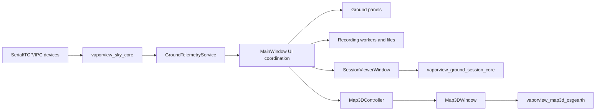
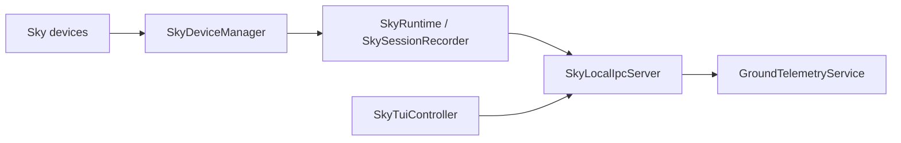

# VaporView Architecture

This document describes the current build and runtime boundaries.  It is kept
close to the source tree so a new module has an obvious home and dependency
direction.

## Executables

| Executable | Responsibility |
| --- | --- |
| `VaporView` | Ground desktop UI, navigation, device coordination, recording controls, session and map entry points. |
| `VaporViewSkyCore` | Sky-side device, transport, recording, and IPC core process. |
| `VaporViewSkyTui` | Sky-side terminal UI process. |
| `VaporViewSky` | Sky startup/application wrapper. |
| `str2str` | RTKLIB stream server utility, when the bundled RTKLIB source is present. |

The Sky Core and Sky TUI remain separate processes.  Ground UI changes must
not move protocol or IPC work across that process boundary.

## Source layout

```text
src/
  ground/
    CMakeLists.txt
    session/   # session parsing, indexing, playback, recording layout
    devices/   # ground-side remote telemetry decoding and normalization
    widgets/   # ground telemetry panel declarations and UI contracts
    map/       # ground-side Map3DController (optional osgEarth build)
  shared/      # small cross-ground targets such as waveform encoding
  geo/         # coordinate and trajectory core
  map3d/       # osgEarth/OSG rendering and map data (optional)
  sky/         # Sky runtime and TUI sources
include/
  ground/      # stable ground-session data contracts used by public dialogs
  geo/         # stable geo interfaces
  map3d/       # stable map/render interfaces
  ...          # existing application and protocol public headers
```

Session and ground controller headers are implementation headers under
`src/ground`; they are not part of the public include contract.  Headers under
`include/` are reserved for interfaces shared by more than one target.

## CMake targets and dependencies

Core targets:

```text
vaporview_protocol       -> Qt6::Core
vaporview_wave_encoding  -> Qt6::Core
vaporview_geo_core       -> Qt6::Core
vaporview_app_theme      -> Qt6::Widgets
vaporview_sky_core       -> protocol, wave_encoding, geo, Qt Core/Network/SerialPort
vaporview_sky_tui        -> protocol, app_theme, Qt Core/Network/Widgets
vaporview_ground_device_core
                          -> protocol, geo, Qt6::Core
vaporview_ground_session_core
                          -> wave_encoding, Qt6::Core
vaporview_ground_ui_support
                          -> sky_core, app_theme, Qt6::Widgets/Svg
vaporview_ground_map     -> map3d_osgearth, geo, Qt6::Core/Widgets [optional]
vaporview_map3d_osgearth -> app_theme, geo, Qt Widgets/OpenGL/Concurrent,
                           osgEarth and OpenSceneGraph [optional]
vaporview_main_window    -> ground_session, ground_device_core,
                           ground_ui_support, sky_core, geo, app_theme,
                           RTKLIB, and ground_map [optional]
```

The top-level `CMakeLists.txt` discovers dependencies and defines the existing
application targets.  Module-owned targets are defined in:

- `src/shared/CMakeLists.txt`
- `src/ground/CMakeLists.txt`
- `src/ground/devices/CMakeLists.txt`
- `src/ground/session/CMakeLists.txt`
- `src/ground/map/CMakeLists.txt`

`vaporview_ground_session_core` and `vaporview_geo_core` do not link Qt
Widgets.  The optional osgEarth target is kept out of the default build by
`VAPORVIEW_ENABLE_OSGEARTH=OFF`.

## Ground data flow



`SessionLoader`, `SessionCsv`, `SessionIndex`,
`SessionPlaybackController`, `SessionWaveformRepository`, and
`RecordingSessionLayout` operate without a widget.  `SessionViewerWindow` is
the view and interaction entry point; it delegates parsing, indexing, playback,
and waveform access to the session target. `MainWindow` uses
`RecordingSessionLayout` when it creates a new recording directory, keeping
recording-file naming and compatibility paths out of the top-level UI code.

`RemoteTelemetryDecoder` owns the remote `TelemetryBasic` to `EpsilonData`
mapping, fix-code normalization, and ECEF completion. It is a Qt Core-only
ground device service consumed by `MainWindow`, so protocol-field translation
does not live in UI slots.

`Map3DController` owns the optional map window, converts EPSILON data to
`Geo::NavSample`, coalesces live samples on a 50 ms timer, and reports dropped
samples.  `MainWindow` only opens the map, forwards telemetry, and exposes the
existing test seam.

## Sky data flow



Protocol encoding/decoding stays in `vaporview_protocol`; transport and device
implementations stay in `vaporview_sky_core`.  UI targets consume those APIs,
not the reverse.

## Module rules

1. Pure parsing, indexing, formatting, coordinate, and recording-layout code
   belongs in a Qt Core target and must not depend on Qt Widgets.
2. Widgets may depend on core targets, never the other way around.
3. Map rendering stays behind the optional `vaporview_map3d_osgearth` target;
   ground UI code must continue to build with osgEarth disabled.
4. New session behavior goes under `src/ground/session`; new map lifecycle
   coordination goes under `src/ground/map`; OSG rendering changes go under
   `src/map3d`.
5. Do not add the same `.cpp` to more than one target.  Tests link the smallest
   target that provides the behavior under test.
6. Do not expose private ground/session or ground/map headers through
   `include/` unless another target needs a stable public contract.
