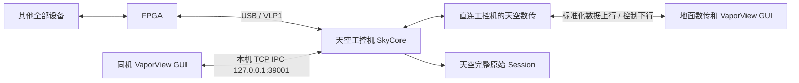

# 天空端 FPGA 与数传部署

最终接线以用户确认的天空端工控机为中心：



SkyCore 唯一打开 USB 并持续接收 VLP1。同机 GUI 复用 `RemoteSkyController`，连接本机 IPC；地面 GUI 连接数传串口或 TCP 遥测。两个客户端可同时观察和控制同一 SkyCore，均不另开 USB 或设备串口。`fpga.enabled` 默认 false；显式启用后连接/探测不等于打开物理输出。

## 数据源与传感器路径是两个独立维度

Ground 的 Local/Remote 只表示“当前由谁持有上位机链路”：Local 是
VaporView 本机，Remote 是 SkyCore。它不表示传感器是否经过 FPGA。设备配置页另有
“传感器路径”选择：

| 数据源主机 | 传感器直连 | FPGA 中转 |
| --- | --- | --- |
| VaporView Local | 传感器串口 → VaporView | 传感器 → FPGA → VaporView 的 FPGA USB/VLP1 |
| SkyCore Remote | 传感器串口 → SkyCore → 遥测 → VaporView | 传感器 → FPGA → SkyCore → 遥测/IPC → VaporView |

本地配置保存为 `MainWindow/sensor/transport_path`，天空端 `SkyConfig` 使用
`sensor_transport_path`，取值为 `direct_devices` 或 `fpga_relay`。默认值是
`direct_devices`，以兼容已有设备现场配置。选择 `fpga_relay` 后，采集数据改由
FPGA 的 VLP1 通道上送，Ground/SkyCore 不再为这些设备启动第二套直连串口采集。
设备配置页中的串口、波特率、频率、数据源和启停仍属于同一份设备意图模型，不能
因为切换传输路径而被禁用；执行层再根据路径选择直连串口命令或 FPGA VLP1 命令。
其中 PC 的 `COMx` 名称不能透传到 FPGA，FPGA 端需要使用板上固定通道/协议支持的
地址、波特率和轮询寄存器。VLP1 尚未提供的字段必须返回明确的 `Unsupported`，不能
静默改走直连串口。

界面测试模式会临时把上述路径切换为 `fpga_relay`，并在 FPGA 页面显示“传感器 →
模拟 FPGA → VaporView”的软件链路；它用于验证布局、状态和路由语义，不创建真实
Windows USB 设备，也不代表已经完成 GP01 实板或 VLP1 原始字节实测。

## 配置与启动

将以下 JSON 保存为工控机上的 `sky-fpga.json`。未提供的 FPGA 配置字段按 `FpgaControlConfig` 默认值处理；旧串口/TCP 采集项显式关闭，避免该部署开启第二套设备链路。空 `locator` 交由后端枚举，必须确认唯一目标设备；多设备时填入该后端诊断显示的设备路径。

```json
{
  "sensor_transport_path": "fpga_relay",
  "fpga": {
    "enabled": true,
    "locator": "",
    "configuration": {
      "backend": "auto",
      "pressureSource": 64,
      "recordSensors": true,
      "recordDlia": true,
      "recordRaw": false,
      "rawWindowSeconds": 10
    }
  },
  "epsilon": {"enabled": false, "rtcm": {"enabled": false}},
  "ptb": {"enabled": false},
  "hmp": {"enabled": false},
  "lidar": {"enabled": false},
  "temperature_controller": {"enabled": false},
  "ai8_temperature_controller": {"enabled": false},
  "wave_tcp": {"enabled": false},
  "telemetry": {
    "basic_rate_hz": 10,
    "feature_rate_hz": 10,
    "waveform_rate_hz": 1,
    "heartbeat_rate_hz": 1,
    "status_rate_hz": 1
  }
}
```

在 `build/Release` 可执行文件所在目录启动；下面 `COM12` 是示例天空数传端口，替换为实际端口和匹配波特率：

```powershell
.\VaporViewSkyCore.exe --sky-config .\sky-fpga.json --telemetry-transport serial --telemetry-port COM12 --telemetry-baud 921600 --ipc-host 127.0.0.1 --ipc-port 39001
```

若数传提供 TCP 链路，SkyCore 作为监听端，使用对应工控机网卡地址和端口；下面以默认遥测端口演示：

```powershell
.\VaporViewSkyCore.exe --sky-config .\sky-fpga.json --telemetry-transport tcp --telemetry-host 0.0.0.0 --telemetry-tcp-port 39100 --ipc-host 127.0.0.1 --ipc-port 39001
```

上述串口和 TCP 是两种遥测启动方式，选其一；本机 IPC 与所选遥测方式独立并存。不要加 `--no-ipc`，也不要运行第二个 SkyCore/VaporViewSky 实例占用同一 USB 或数传端口。`VaporViewSky` 是另一个包含 Core 的入口，不能与已启动的独立 Core 同时持有设备。

启动同机 `VaporView.exe`，首页选择 Remote，链路选择 TCP，主机 `127.0.0.1`、端口 `39001`。地面 GUI 同样选择 Remote，但连接地面数传实际串口，或 SkyCore 遥测 TCP `39100` 可达地址。`39001` 是同机 IPC，`39100` 是 TCP 遥测，两者用途不同。观察 FPGA 页的 USB connected、ready、模块版本及硬件实际读回；无设备、驱动缺失或探测失败必须显示失败，不能按配置默认值显示就绪。

## 控制与记录边界

传感器配置的目标是“设备配置意图 → 传输适配器”：直连路径交给现有串口采集器，
中转路径交给 VLP1 `WRITE_REG`/`SENSOR_ACTION`，并按下位机要求执行提交、状态等待
和读回确认。当前界面已经保持两条路径共用设备配置控件；尚未接入实板的字段必须
在日志和命令结果中标明待映射或不支持，不能把“控件可编辑”当成已经完成硬件下发。

独立 FPGA 页发送 `DeviceOperation::FpgaControl`，SkyCore 对动作执行 allowlist 校验并串行处理，最终结果来自异步事务及读回；请求受理或普通寄存器 ACK 不等于完成。当前 allowlist 包含连接/断开、刷新、配置、采集、WMS、DAC、传感器、限时 RAW 和 AI8 设温，详细确认条件仍见 [协议适配](fpga_vlp1_integration.md)。

VLP1 尚未提供的 RTCM 下行、EPSILON 高级参数操作应返回 `Unsupported`，不能绕到设备串口或构造未知 VLP1 命令。超时不盲目重发，先读取最终设备状态；本机 IPC 与数传请求均须仅执行一次。

SkyCore 在天空端保存完整 Session：`raw/fpga_vlp1.dat` 的 source=8、type1 完整 IN、type2 OUT、type3 配置/校准/连接快照、type4 精确 USB IN；语义摘要在 `sensors/fpga_frames.jsonl`。记录选项只影响完整帧/解析摘要，不能删除已收到的精确 USB 块。队列有界，写入/溢出/flush 失败标记 incomplete；pause/stop 排空，stop 结束写线程。

数传默认发送标准化设备数据、状态、命令结果和有界波形预览；RAW 默认关闭，不默认搬运全量 USB/RAW。地面 Session 保存既有标准遥测测量，新 FPGA 状态与波形预览用于界面显示，当前不存入地面 FPGA 原始归档。需要完整离线回放时，取得天空 Session 副本。GUI/数传掉线不应误停 SkyCore 采集或记录，重连后重新建立观察状态，不能把历史预览当新鲜测量。

## 串口数传的软件带宽边界

串口固定使用 8N1，无流控。理论有效载荷上限为 `baud / 10` 字节/秒；115200 对应 11520 B/s。这是串口线路理论值，不能作为无线数传吞吐实测结果，实际可用速率可能更低。

FPGA 诊断 Sensor 和 Preview 共用 `baud / 40` B/s 的令牌预算，即理论有效载荷的 25%；桶容量为一秒预算，允许一次有界突发，每个诊断帧连同 21 字节遥测封装不能超过半秒预算。115200 对应共享 2880 B/s、单帧不超过 1440 字节。每个 Sensor 源最多发送一次/秒；预算不足跳过整帧，不积压历史数据。Preview 按实际编码长度选择最多 64/32/16/8 点，连 8 点也不适合预算时跳过整帧；新增抽稀因子与已有 stride 相乘，原始周期点数和实际采样率保持不变。发送队列已有超过 200 ms 理论载荷时，也跳过诊断帧。

物理串口上的 FPGA Status 合并为最多 1 Hz 的最新值。控制 ACK、最终 DeviceOperationResponse 和标准 Basic/AI8 不参与诊断采样或降点；这并不保证任意配置的标准遥测速率都适合无线链路。串口待发送队列硬上限为 `max(16 KiB, baud / 10 × 2)`，超过上限明确报错并关闭数传链路，控制投递须视为未确认，不能静默丢弃 ACK 或盲目重发写命令。115200 的队列上限为 23040 字节。

这些限制只作用于物理串口输出；本机 IPC 仍接收原有最多 64 点预览及原频率，状态即时/周期通知保持原行为，USB 接收和天空完整 Session 归档继续独立运行。窄带地面预览可能降点、缺帧或暂时不显示，不能据此判断天空未采集，也不能用地面预览代替完整天空归档。TCP 遥测不使用此串口诊断预算。

## 验证状态

本文配置键、启动选项和架构对应当前源码接口。本轮天空拓扑软件构建/测试结果见 [协议适配验证记录](fpga_vlp1_integration.md#12-天空端拓扑最终软件验证记录2026-10-10)；历史 `7b68482` 仅验证 Ground 本机适配。没有 GP01 实板，也没有 Cypress SDK 分支实测。单 USB 所有者、IPC/数传并存、断线连续采集、最终读回、吞吐和归档完整性需按 [实机清单](fpga_hardware_validation.md) 验收。
